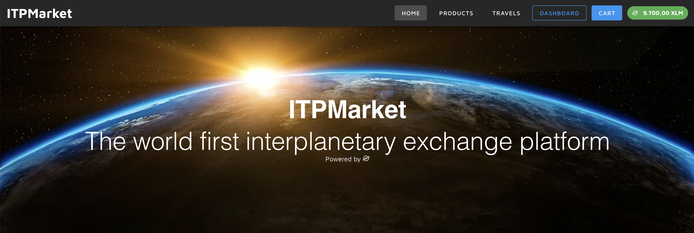
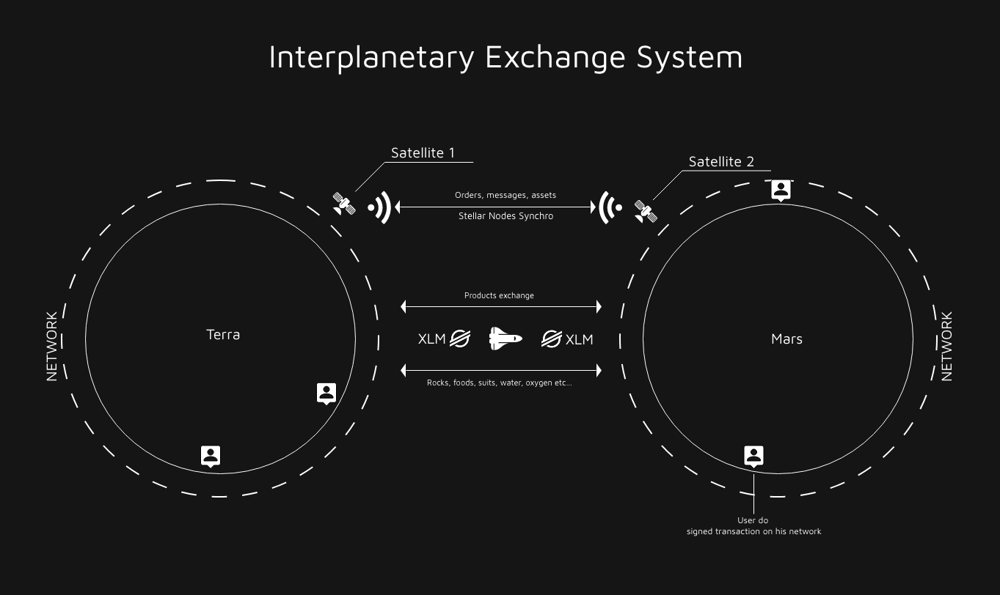

# ITP Market

### The world first interplanetary e-commerce based on Stellar Lumens (XLM) blockchain



Hi !
I'm Ayrton, a french developper. 

I have created the first interplanetary e-commerce based on the blockchain Stellar Lumens (XLM).

The project is under construction and is build with VueJs.

All of data inside it's demo.

Kiss

## Features

- [x] Web 3.0
- [x] Stellar Lumens Test Network connection support
- [x] Freighter wallet support (https://www.freighter.app/)
- [x] Buy Products
- [x] Buy Travels
- [x] Dashboard
- [x] Last transactions list
- [x] Offline mode 
- [x] Cargo (Rocket payload management)


## Demo
[](https://app.netlify.com/sites/itp-platform/deploys)

See the demo
https://itp-platform.netlify.app

## Documentation

UNDER CONSTRUCTION

## Think schema



## Project setup
```
npm install
```

### Compiles and hot-reloads for development
```
npm run serve
```

### Compiles and minifies for production
```
npm run build
```

### Lints and fixes files
```
npm run lint
```

### Customize configuration
See [Configuration Reference](https://cli.vuejs.org/config/).
